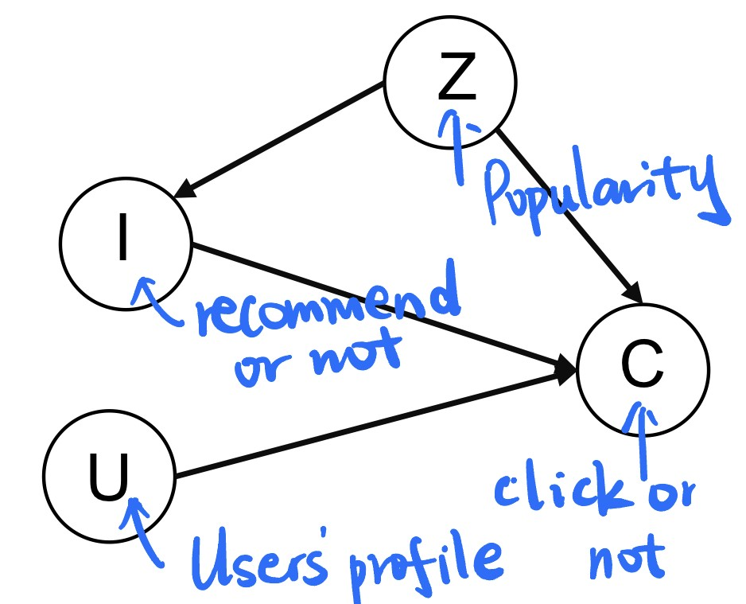
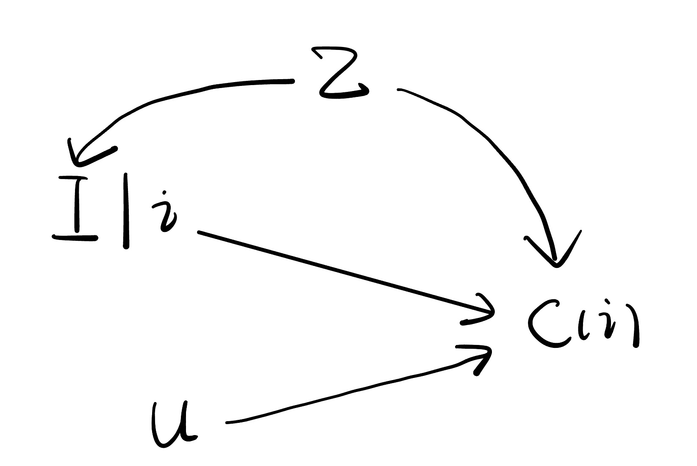
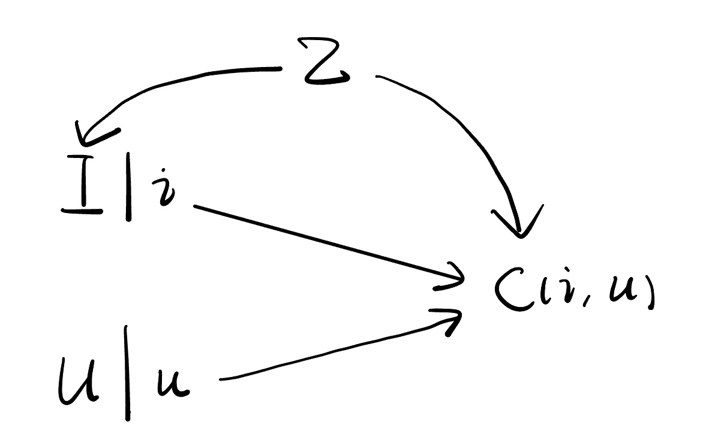

Recall that in [Homework 2](https://qilin-li-math-888.netlify.app/post/homework2/), we have created a causal graph with 5 nodes. In a recent work on popularity bias , [Zhang et al. (2021)](#PDA) studies a special case where the only item attribute considered is its popularity which is characterized as a confounder. The following figure shows this special case.

Next, we translate the identification part of this work into the language we used in our class. The question is "given a user's profile, what will the probability of clicking be if we recommend the item to this user?". To answer this question, we need to intervene on $I$. Then, we have the following SWIG.

 

The causal effect we are interested in is $\mathbb{E}\left[ C(i)\middle| U \right]$. Since this is conditioned on $U$, we further intervene on $I$ and $U$, which leads to the following SWIG.

 

On the one hand, 


$$
\begin{aligned}
    \mathbb{E}\left[ C(i,u) \right] &= \mathbb{E}\left[ C(i,u)\middle| U=u \right] \\
    &= \mathbb{E}\left[ C(i,U)\middle| U=u \right] \\
    &= \mathbb{E}\left[ C(i,U(i))\middle| U(i)=u \right] \\
    &= \mathbb{E}\left[ C(i)\middle| U=u \right].
\end{aligned}
$$


The first step is from the fact that d-separation implies conditional independence. The third step is by causal irrelevance. The last step is by consistency and causal irrelevance. In fact, we can simply apply the Rule 2 of Po-calculus here which is equivalent to these four steps.

On the other hand, by backdoor adjustment, 


$$
\mathbb{E}\left[ C(i,u) \right]=\mathbb{E}\left\{\mathbb{E}\left[ C \middle| I=i,U=u,Z \right ]\right\}.
$$


Therefore,


$$
\mathbb{E}\left[ C(i)\middle| U=u \right]=\mathbb{E}\left\{\mathbb{E}\left[ C\middle| I=i,U=u,Z \right]\right\}.
$$


In this way, we express the causal effect in terms of observed random variables. The identification is done!

## References

- [1] [Causal Intervention for Leveraging Popularity Bias in Recommendation](https://arxiv.org/abs/2105.06067v1)

