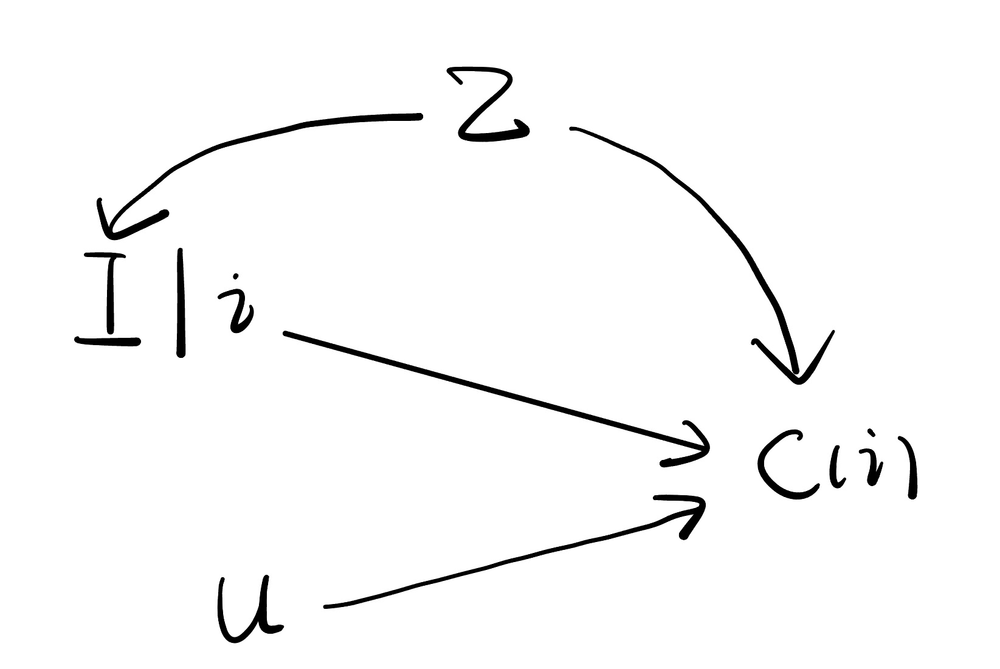
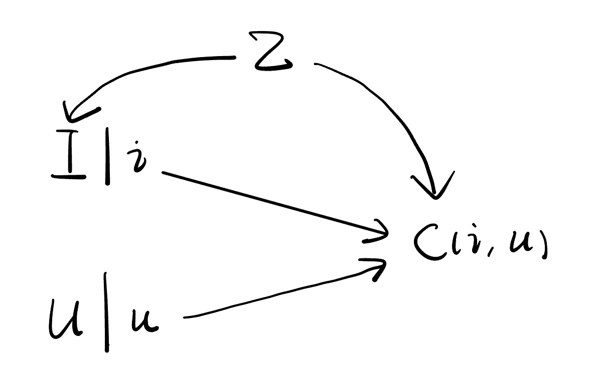

In a recent work [1](#PDA), Zhang et al. (2021) characterized the item popularity as a confounder, and then developed a method, Popularity-bias Deconfounding(PD), to eliminate popularity bias in recommendation. The following causal graph shows the assumptions they made on how the training data is generated.

In this causal graph, $Z$ is a vector which represents the popularity of all items. $I=i,U=u$ means we recommend the $i$ th item to the user $u$. $C$ is a 0-1 variable that indicates the click event.

Notice that there is no path between the node $I$ and $U$, which means the users' profiles are not involved in the recommendation process. This is reasonable at the very beginning stage of a recommender system when the users' profiles are unavailable. The goal of this work is to establish a predictive procedure based on the training data from this early stage. Of course, unlike the model for training data, the predictive procedure should take uses' profiles into count.

Next, we translate the identification part of this work into the language we used in our class. The question is "given user $u$'s profile, what will the probability of clicking be if we recommend the $i$th item to this user?". To answer this question, we need to intervene on $I$. Then, we have the following SWIG.

 

The causal effect we are interested in is $\mathbb{E}\left[ C(i)\middle| U \right]$. Since this is conditioned on $U$, we further intervene on $I$ and $U$, which leads to the following SWIG.

 

On the one hand, 

$$
\begin{aligned}
    \mathbb{E}\left[ C(i,u) \right] &= \mathbb{E}\left[ C(i,u)\middle| U=u \right] \\
    &= \mathbb{E}\left[ C(i,U)\middle| U=u \right] \\
    &= \mathbb{E}\left[ C(i,U(i))\middle| U(i)=u \right] \\
    &= \mathbb{E}\left[ C(i)\middle| U=u \right].
\end{aligned}
$$


The first step is from the fact that d-separation implies conditional independence. The third step is by causal irrelevance. The last step is by consistency and causal irrelevance. In fact, we can simply apply the Rule 2 of Po-calculus here which is equivalent to these four steps.

On the other hand, by backdoor adjustment, 

$$
\mathbb{E}\left[ C(i,u) \right]=\mathbb{E}\left\{\mathbb{E}\left[ C\middle|I=i,U=u,Z \right]\right\}.
$$


Therefore,

$$
\mathbb{E}\left[ C(i)\middle| U=u \right]=\mathbb{E}\left\{\mathbb{E}\left[ C\middle|I=i,U=u,Z \right]\right\}.
$$


In this way, we express the causal effect in terms of observed random variables. The identification is done!

In the end, we compare this new causal estimand with the traditional one, $\mathbb{E}\left[ C\middle| I=i,U=u \right]$. For simplicity, we assume $Z$ comes from a discrete distribution. Then, the causal estimand can be identified as

$$
\mathbb{E}\left[ C(i)\middle| U=u \right]=\sum_z \mathbb{P}\left( C=1\middle|I=i,U=u,Z=z \right)\mathbb{P}\left( Z=z \right).
$$


The original one can be written as

$$
\begin{aligned}
    \mathbb{E}\left[ C\middle| I=i, U=u  \right] &= \mathbb{P}\left( C=1\middle| I=i , U=u \right) \\
    &= \sum_z\mathbb{P}\left[ C=1\middle| I=i,U=u ,Z=z \right]\mathbb{P}\left(Z=z\middle| I=i,U=u\right) \\
    &= \sum_z\mathbb{P}\left[ C=1\middle| I=i,U=u ,Z=z \right]\mathbb{P}\left(Z=z\middle| I=i\right) \\
    &\propto \sum_z\mathbb{P}\left[ C=1\middle| I=i,U=u ,Z=z \right]\mathbb{P}\left(I=i\middle| Z=z\right)\mathbb{P}\left( Z=z \right).
\end{aligned}
$$


Comparing these two expression, we can see the causal estimand drops a term: $\mathbb{P}\left(I=i\middle| Z=z\right)$. Due to the popularity bias in the exposure mechanism, this term will be larger for those items with larger popularity. Hence, dropping this term is a reasonable adjustment to the traditional method.

## References

- [1] [Causal Intervention for Leveraging Popularity Bias in Recommendation](https://arxiv.org/abs/2105.06067v1)

