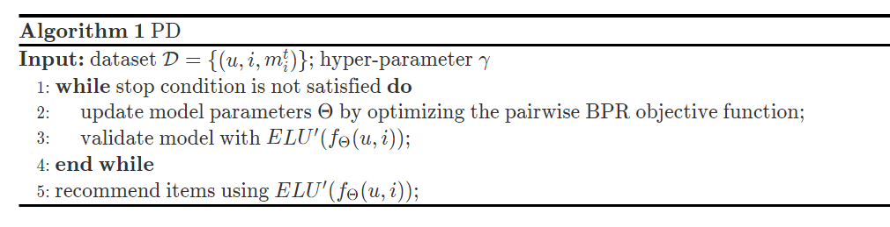

## Estimation method

Last time, we have identified the followiing causal effect.

$$
\mathbb{E}\left[ C(i)\middle| U=u \right]=\mathbb{E}\left\{\mathbb{E}\left[ C\middle|I=i,U=u,Z \right]\right\}.
$$


To estimate the statistical estimand on the RHS, we first estimate $\mathbb{E}\left[ C\middle|I=i,U=u,Z \right]$. This can be down with some traditional recommendation training method. For example, optimizing the pairwise BPR objective function on historical data $\mathcal{D}$:

$$
\begin{aligned}
  \max_\Theta \sum_{(u,i,j)\in\mathcal{D}} \log \sigma ( \mathbb{E}_\Theta \left[ C\middle|I=i,U=u,Z=m_i^t \right] \\
  - \mathbb{E}_\Theta \left[ C\middle|I=i,U=u,Z=m_j^t \right] ) - \lambda\left\Vert \Theta \right\Vert_2^2,
\end{aligned}
$$

where $\Theta$ denotes the parameters modeling $\mathbb{E}\left[ C\middle|I=i,U=u,Z \right]$, $j$ denotes the negative sample for $u$, $\sigma (\cdot)$ is the sigmoid function.

It remains to show how to parameterize $\mathbb{E}_\Theta \left[ C\middle|I=i,U=u,Z=m_i^t \right]$ specifically. To decouple the user-item match with item popularity, we design the model as:

$$
\mathbb{E}_\Theta \left[ C\middle|I=i,U=u,Z=m_i^t \right] = ELU'(f_\Theta (u,i))\times (m_i^t)^\gamma,
$$

where $f_\Theta (u,i)$ can be any user-item mathcing model and we choose the simple _Matrix Factorization_ (MF) here; hyperparameter $\gamma$ is to control the strenth of conformity effect. $ELU'(\cdot)$ is a variant of the Exponential Unit active function that ensures the positivity of the matching score:

$$
\begin{equation*}
ELU'(x)=
    \begin{cases}
        e^x & \text{if } x \leq 0\\
        x+1 & \text{else }.
    \end{cases}
\end{equation*}
$$


Lastly, since we are only interested in the rank of items, we do not need to normalize the estimation to make it a rigorous probability.

Now we move forward to estimate $\mathbb{E}\left\{\mathbb{E}\left[ C\middle|I=i,U=u,Z \right]\right\}$. Plug in the model for $\mathbb{E}_\Theta \left[ C\middle|I=i,U=u,Z \right]$. 


$$
\begin{align}
    \mathbb{E}\left\{\mathbb{E}\left[ C\middle|I=i,U=u,Z \right]\right\} & = \mathbb{E}\left\{\mathbb{E}_\Theta \left[ C\middle|I=i,U=u,Z \right]\right\} \\
    & = ELU'(f_\Theta (u,i))\times \mathbb{E}\left[Z^\gamma\right].
\end{align}
$$


Notice that $ \mathbb{E}\left[Z^\gamma\right] $ is a constant. Ignoring it will not affect ranking. Hence, we can simply use $ ELU'(f_\Theta (u,i)) $ to estimate $\mathbb{E}\left[ C(i)\middle| U=u \right]$.

To summarize, we fit the historical interaction data with $\mathbb{E}_\Theta \left[ C\middle|I=i,U=u,Z=m_i^t \right]$, and use the user-item matching component $ ELU'(f_\Theta (u,i)) $ for deconfounded ranking. We name this method as Popularity-bias Deconfounding (PD). Combined with cross-validation, we have the following algorithm.

## Datasets

In this article, experiments are conducted on three datasets. We summarize them in the following table.

|  dataset   | output type  | size |
|  :----:  | :----:  | :----:  |
| Kwai  | clicking | 7,658,510 interactions between 37,663 users and 128,879 items |
| Douban Movie  | rating | 7,174,218 interactions between 47,890 users and 26,047 items |
| Tencent | likes | 1,816,046 interactions between 80,339 users and 27,070 items |

From the table above, we can see that although we call $C$ "clicking", it is not necessary to be 0-1 value. It can be integer-valued or continuously valued rating. That is why this blog use the notation $\mathbb{E}[C\ldots]$ instead of $\mathbb{P}(C=1\ldots)$ as in the orinal paper. 

## References

- [1] [Causal Intervention for Leveraging Popularity Bias in Recommendation](https://arxiv.org/abs/2105.06067v1)
