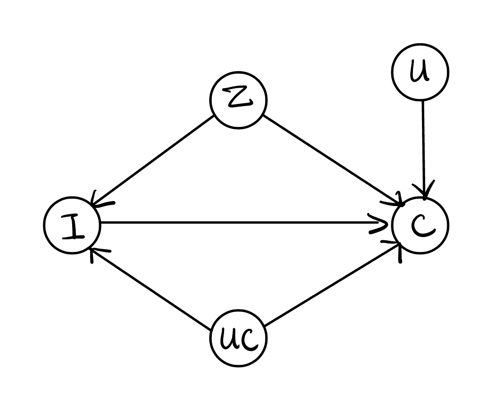

In the original article [1](#PDA), the authors focus on the method for identification and estimation, while do not put much effort in discussing the assumptions. There is no sensitivity analysis part in the article. However, the authors do make some important assumptions that worth discussion. One of those assumptions is that the populairty($Z$) is the only confounder between the item($I$) and the outcome($C$). This assumption is nontrivial since there might be other factors got involved in the process of recommendation but we fail to take them into account. When this assumption is violated, there will be an unmeasured confounder $UC$ between $I$ and $C$ (as the following figure shows). Hence, we can apply sensitivity analysis here to discuss this assumption. In this blog, I will try to apply those methods we learned in class to this problem.

Recall that the causal estimand we are interested in is $\mathbb{E}\left[C(i)\middle| U=u\right]$. For the following parts, we focus on comparing the outcomes of treatment assignments $i$ and $j$ while condition on $U$. In mathematical words, we are intersted in the following quantity

$$
\mathbb{E}\left[C(i)-C(j)\middle| U=u\right]. 
$$


## Manski's Method

Since we have conditioned on $U$, we can remove the node $U$ from the causal graph above, and then we obtain the same graph as the one we learned for Manski's method. Unfortunately, it does not make sense to assume individual treatment response is monotone since $i$ and $j$ represent items with the same status and there is no reason to believe one is more likely to be clicked on than another.

Hence, we can only work on the no assumptions case. We still need assume $C$ is bounded between $K_L$ and $K_U$. This is true for clicking and rating, while may fail for likes. After all above, there is still a deference from what we learned in class due to the multiple levels of the intervention $I. Next, we slightly modify the derivation in class to obtain the bound we need.


$$
\begin{aligned}
&\mathbb{E} \left[C(i)-C(j)\middle| U=u\right] =\\
\mathbb{E} & \left[C\middle| I = i, U=u\right]\mathbb{P}\left(I=i\middle| U=u\right)+ \\
\mathbb{E} & \left[C(i)\middle| I \not= i, U=u\right]\mathbb{P}\left(I\not=i\middle| U=u\right)- \\
\mathbb{E} & \left[C\middle| I = j, U=u\right]\mathbb{P}\left(I=j\middle| U=u\right) - \\
\mathbb{E} & \left[C(i)\middle| I \not= j, U=u\right]\mathbb{P}\left(I\not=j\middle| U=u\right).
\end{aligned}
$$


Therefore, 


$$
\begin{aligned}
\mathbb{E} \left[C(i)-C(j)\middle| U=u\right] \geq &  C+K_L\mathbb{P}\left(I\not=i\middle| U=u\right) \\
& -K_U\mathbb{P}\left(I\not=j\middle| U=u\right), \\
\mathbb{E} \left[C(i)-C(j)\middle| U=u\right] \leq &  C+K_U\mathbb{P}\left(I\not=i\middle| U=u\right) \\
& -K_L\mathbb{P}\left(I\not=j\middle| U=u\right), 
\end{aligned}
$$


where $C = \mathbb{E}\left[C\middle| I = i, U=u\right]\mathbb{P}\left(I=i\middle| U=u\right)-\mathbb{E} \left[C\middle| I = j, U=u\right]\mathbb{P}\left(I=j\middle| U=u\right)$. In the context of recommender system, $K_L$ is often 0. Then the bound becomes


$$
\begin{aligned}
\mathbb{E} \left[C(i)-C(j)\middle| U=u\right] \geq &  C-K_U\mathbb{P}\left(I\not=j\middle| U=u\right), \\
\mathbb{E} \left[C(i)-C(j)\middle| U=u\right] \leq &  C+K_U\mathbb{P}\left(I\not=i\middle| U=u\right).
\end{aligned}
$$


These bounds do not contain $Z$ since PD is a procedure to deconfound $Z$. Although it doe not matter whether $Z$ is measured, we do need to worry about confounders other than popularity. This is because by specifying the estimation model, $Z$ can only represent popularity and it does not make sense to include other confounders into $Z$. In other words, PD deconfound only the popularity rather than arbitrary unmeasured confounder. Hence, it is worthy to de sensitivity analysis. 

## Other methods

We can also resort to Rosenbaum's and VanderWeele's methods for sensitivity analysis. However, the methods we learned in class are all for binary intervention. I am not sure how to general them into multi-level case. There is a work 

## References

- [1] [Causal Intervention for Leveraging Popularity Bias in Recommendation](https://arxiv.org/abs/2105.06067v1)
